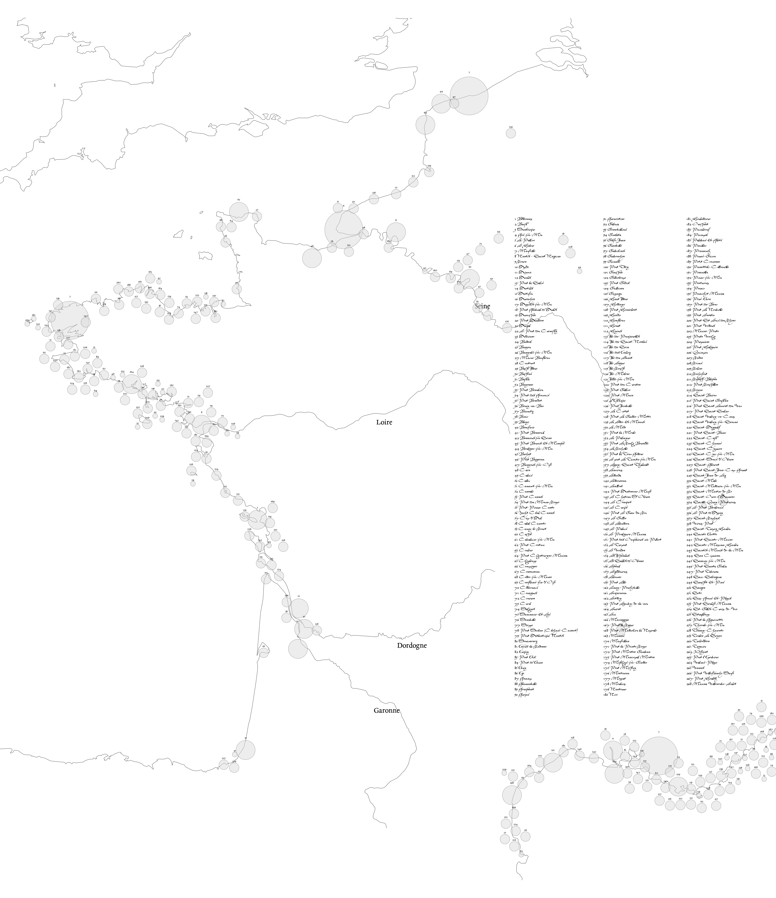

# Recreating the work of Minard in R

If you are into data viz, then I am pretty sure that you have seen the chart above before. E. Tufte 
once declared this to be "the best statistical graphic ever drawn". 

What you might not know is that its creator, [Charles Joseph Minard](https://en.wikipedia.org/wiki/Charles_Joseph_Minard), made far more significant contributions in the field of information graphics. Especially with his flow maps.
[Sandra Rendgen](https://twitter.com/srendgen) dedicated a book, "The Minard System", which shows 61 maps and plots
that Minard produced during his lifetime. The book is really inspiring and I can only recommend it. One cold winter day in 
early 2021, I decided to try to recreate some of Minards work with R. I was particularly interested in his [flow maps](https://heritage.ecoledesponts.fr/ark:/12148/btv1b104811770.r=Minard?rk=300430;4). This was also actually the starting point for me to develop the R package `edgebundle`. I had the ambitious goal to reproduce as many of his 61 drawings as possible. 

## (11) Ports in France I

[Code](https://github.com/schochastics/minard/tree/master/011-maritime_ports_france)

## (14) English Coal Exports I

[Code](https://github.com/schochastics/minard/tree/master/014-english_coal_1987)

## (21) Meat Sent to Paris

[Code](https://github.com/schochastics/minard/tree/master/021-meat_to_paris)

## (24) Ports in France II

[Code](https://github.com/schochastics/minard/tree/master/024-maritime_ports_france_2)

## (25) Cargo Ports in Europe

[Code](https://github.com/schochastics/minard/tree/master/025-cargo_ports_eu)

## (34) Cargo Ports of the Globe

[Code](https://github.com/schochastics/minard/tree/master/034-global_ports)

## (38) Global Migrants

[Code](https://github.com/schochastics/minard/tree/master/038-migrants_globe)

## (41) English Coal Exports II

[Code](https://github.com/schochastics/minard/tree/master/041-english_coal_1997)

## (48) Post Offices in Paris

[Code](https://github.com/schochastics/minard/tree/master/048-post_office_paris)

## (50) French Wine Exports

[Code](https://github.com/schochastics/minard/tree/master/050-french_wine)

## (53) English Coal Exports III

[Code](https://github.com/schochastics/minard/tree/master/053-english_coal_2017)

## (54) Global Coal Production

[Code](https://github.com/schochastics/minard/tree/master/054-coal_production)

## (60) Napoleon’s Campaign

[Code](https://github.com/schochastics/minard/tree/master/060-napoleon_russia)

 
 

